<!-- 
  ╔══════════════════════════════════════════════════════════════════════════════════════════╗
  ║  Welcome to my GitHub Universe! This README is designed to be a living, breathing       ║
  ║  representation of my journey as a developer. Every pixel has a purpose.                ║
  ╚══════════════════════════════════════════════════════════════════════════════════════════╝
-->

<div align="center">

<!-- Animated Wave Header -->


<!-- Typing SVG with rotating quotes -->
<a href="https://git.io/typing-svg">
  
</a>

<!-- Animated Badges Row -->
<div>
  
  
  
  
</div>

</div>

<!-- Matrix Rain Effect Divider -->


##  About Me


```javascript
const developer = {
    name: "Your Name",
    pronouns: "He" | "Him",
    code: ["JavaScript", "TypeScript", "Python", "Go", "Rust"],
    currentFocus: "Building scalable microservices with AI integration",
    dailyRoutine: {
        morning: "☕ Coffee → 📧 Check Issues → 💻 Code",
        afternoon: "🔍 Code Review → 🚀 Deploy → 📚 Learn",
        evening: "🎨 Side Projects → 📖 Tech Articles → 🎮 Gaming"
    },
    funFact: "I debug with console.log and I'm not ashamed! 😄",
    lifePhilosophy: "Clean code is not written by following a set of rules. " +
                    "It's a mindset of craftsmanship and continuous improvement."
};
```

<details>
<summary>🎯 <b>Current Goals for 2025</b></summary>
<br>

- 🏆 Contribute to 100+ open source projects
- 📚 Master Rust and contribute to the ecosystem
- 🎓 Complete AWS Solutions Architect certification
- 🌟 Reach 1000+ GitHub stars across projects
- 🎤 Speak at 3+ tech conferences
- ✍️ Write 50+ technical blog posts

</details>

<!-- Animated Divider -->


##  Tech Arsenal

<div align="center">

### 🎨 Frontend Wizardry
<p>
  
</p>

### ⚙️ Backend Sorcery
<p>
  
</p>

### 🗄️ Database & Cloud Magic
<p>
  
</p>

### 🛠️ Tools & DevOps Arsenal
<p>
  
</p>

### 🤖 AI/ML & Data Science
<p>
  
</p>

<!-- Skill Progress Bars -->
<details>
<summary><b>⚡ Skill Proficiency Matrix</b></summary>
<br>

```text
JavaScript/TypeScript ████████████████████ 95%
Python                ██████████████████░░ 90%
React/Next.js         ████████████████████ 95%
Node.js               ██████████████████░░ 90%
AWS/Cloud             ████████████████░░░░ 85%
Docker/K8s            ████████████████░░░░ 80%
System Design         ██████████████████░░ 90%
Problem Solving       ████████████████████ 95%
```

</details>

</div>

<!-- Animated Coding GIF -->
<div align="center">
  
</div>

##  GitHub Analytics

<div align="center">
  
<!-- GitHub Stats Cards with Animation -->


<!-- GitHub Streak Stats -->


<!-- Activity Graph -->


<!-- Trophy Case -->


</div>

<!-- Detailed Stats Table -->
<details>
<summary>📊 <b>Detailed Statistics</b></summary>
<br>
<div align="center">

| 🏆 Achievements | 📈 Metrics |
|----------------|------------|
| ⭐ Total Stars Earned |  |
| 🔥 Total Commits (2024) |  |
| 📦 Total PRs |  |
| 🛠Issues Resolved |  |
| 👥 Contributed to |  |

</div>
</details>

##  Featured Projects

<div align="center">

<!-- Project Cards with Hover Effects -->
<table>
  <tr>
    <td width="50%">
      <h3 align="center">🚀 Project Alpha</h3>
      <div align="center">
        <a href="https://github.com/yourusername/project-alpha" target="_blank">
          
        </a>
        <p>
          <a href="https://github.com/yourusername/project-alpha" target="_blank">
            
          </a>
          <a href="https://project-alpha.com" target="_blank">
            
          </a>
        </p>
        <p><strong>JavaScript, React, Node.js, MongoDB</strong></p>
      </div>
    </td>
    <td width="50%">
      <h3 align="center">🎨 Project Beta</h3>
      <div align="center">
        <a href="https://github.com/yourusername/project-beta" target="_blank">
          
        </a>
        <p>
          <a href="https://github.com/yourusername/project-beta" target="_blank">
            
          </a>
          <a href="https://project-beta.com" target="_blank">
            
          </a>
        </p>
        <p><strong>Python, FastAPI, PostgreSQL, Docker</strong></p>
      </div>
    </td>
  </tr>
  <tr>
    <td width="50%">
      <h3 align="center">🤖 AI Assistant</h3>
      <div align="center">
        <a href="https://github.com/yourusername/ai-assistant" target="_blank">
          
        </a>
        <p>
          <a href="https://github.com/yourusername/ai-assistant" target="_blank">
            
          </a>
        </p>
        <p><strong>Python, TensorFlow, OpenAI, Flask</strong></p>
      </div>
    </td>
    <td width="50%">
      <h3 align="center">⚡ Lightning CLI</h3>
      <div align="center">
        <a href="https://github.com/yourusername/lightning-cli" target="_blank">
          
        </a>
        <p>
          <a href="https://github.com/yourusername/lightning-cli" target="_blank">
            
          </a>
          <a href="https://www.npmjs.com/package/lightning-cli" target="_blank">
            
          </a>
        </p>
        <p><strong>Go, Cobra, GitHub API</strong></p>
      </div>
    </td>
  </tr>
</table>

</div>

##  Recent Activity

<!-- GitHub Activity Feed -->
<!--START_SECTION:activity-->
```markdown
🎯 Recent GitHub Activity
1. 🎉 Merged PR #142 in awesome-project/backend
2. 💪 Opened PR #253 in open-source/contribution
3. ⭐ Starred trending-repo/amazing-tool
4. 🐛 Opened Issue #42 in community/project
5. 💬 Commented on Issue #123 in tech/discussion
```
<!--END_SECTION:activity-->

<!-- Contribution Snake Animation -->
<div align="center">
  <picture>
    <source media="(prefers-color-scheme: dark)" srcset="https://raw.githubusercontent.com/yourusername/yourusername/output/github-contribution-grid-snake-dark.svg">
    <source media="(prefers-color-scheme: light)" srcset="https://raw.githubusercontent.com/yourusername/yourusername/output/github-contribution-grid-snake.svg">
    
  </picture>
</div>

##  Connect & Collaborate

<div align="center">
  
[](https://linkedin.com/in/yourprofile)
[](https://twitter.com/yourhandle)
[](https://dev.to/yourprofile)
[](https://medium.com/@yourprofile)
[](https://youtube.com/@yourchannel)
[](https://discord.gg/yourserver)
[](mailto:your.email@example.com)
[](https://yourportfolio.com)

### 💬 Let's Talk About

<p>
  
  
  
  
  
  
  
</p>

</div>

##  Support My Work

<div align="center">

If you find my projects helpful or inspiring, consider supporting my work!

[](https://buymeacoffee.com/yourprofile)
[](https://paypal.me/yourprofile)
[](https://patreon.com/yourprofile)
[](https://ko-fi.com/yourprofile)

</div>

## 📚 Latest Blog Posts

<!-- BLOG-POST-LIST:START -->
- 🔥 [Building Scalable Microservices with Kubernetes](https://yourblog.com/post1)
- 💡 [The Art of Clean Code: A Practical Guide](https://yourblog.com/post2)
- 🚀 [Optimizing React Performance: Advanced Techniques](https://yourblog.com/post3)
- 🎨 [Design Patterns That Every Developer Should Know](https://yourblog.com/post4)
- 🤖 [Introduction to Machine Learning for Web Developers](https://yourblog.com/post5)
<!-- BLOG-POST-LIST:END -->

## 🎵 Vibing to

<div align="center">

[](https://open.spotify.com/user/yourusername)

*"Code is like music; when done right, it flows beautifully"* 🎶

</div>

## 💭 Random Dev Quote

<div align="center">


</div>

## 🎮 When I'm Not Coding

```mermaid
graph TD
    A[Not Coding 🤔] --> B{What to do?}
    B -->|Option 1| C[🎮 Gaming]
    B -->|Option 2| D[📚 Reading Tech Books]
    B -->|Option 3| E[🎸 Playing Guitar]
    B -->|Option 4| F[🏃‍♂️ Running]
    B -->|Option 5| G[🍳 Cooking]
    C --> H[Back to Coding 💻]
    D --> H
    E --> H
    F --> H
    G --> H
```

<div align="center">



</div>

<!-- Easter Egg Section -->
<details>
<summary>🥚 <b>Click for a Secret!</b></summary>
<br>
<div align="center">

### 🎉 Congratulations! You found the easter egg! 🎉

Here's a programming joke for you:

> Why do programmers prefer dark mode?
> 
> Because light attracts bugs! 🐛


**Fun Fact:** If you enjoyed this README, you're probably as detail-oriented as I am! 
Let's connect and build something amazing together! 🚀

</div>
</details>

---

<!-- Footer with animated wave -->


<div align="center">
  
### ⚡ "Great code tells a story. What's yours?"


<br>

**[⬆ Back to Top](#)**

<p>
  
  
</p>

<sub>✨ This README updates itself with magic (and GitHub Actions) ✨</sub>

</div>

<!-- 
  Special thanks to all the amazing developers who create these tools and badges!
  Remember to replace 'yourusername' with your actual GitHub username.
  
  Pro tip: Use GitHub Actions to automatically update your recent activity,
  blog posts, and Spotify status to keep this README truly alive!
-->